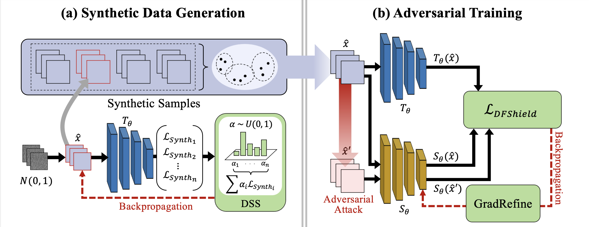

# DataFreeShield: Defending Adversarial Attacks without Training Data

This repository contains the official PyTorch implementation of [DataFreeShield: Defending Adversarial Attacks without Training Data][arxiv] presented at ICML 2024.

[arxiv]: https://arxiv.org/abs/2406.15635v1





## Requirements
```
pip install -r requirements.txt
```

### Pretrained Models
For biomedical dataset ([MedMNIST-V2][med]), we train our own teacher model, which we provide in the below table. 

| Dataset     | ResNet-18 |Acc (%)|  ResNet-50 | Acc (%)| 
|-------------|-----------|-----------|-----------|-----------|
| TissueMNIST |     [link][tissue_rn18]       |67.62|      [link][tissue_rn50]      |68.29|
| BloodMNIST  |    [link][blood_rn18]      | 95.53|  [link][blood_rn50]         |95.00|
| PathMNIST   |       [link][path_rn18]     | 92.19 |   [link][path_rn50]       |91.41|
| OrganCMNIST  |      [link][organc_rn18]      | 90.74 | [link][organc_rn50]         |91.06|

Note that you can also train your own teacher with our script:
```
python3 train_biomedical.py --data_flag tissuemnist --as_rgb --gpu [gpu_id] --model resnet50
```

For general domain datasets (SVHN, CIFAR-10, CIFAR-100), we use pretrained weights from [PytorchCV][CV]. 


[med]: https://medmnist.com
[CV]: https://github.com/donnyyou/PyTorchCV
[tissue_rn18]:https://drive.google.com/file/d/1JlxiMM_MTG-qAg4k4a3aCsyltJnUe87F/view?usp=share_link
[tissue_rn50]:https://drive.google.com/file/d/1Y3pz1SrQjwtoU2MNprkXvXlwvZQADA9f/view?usp=share_link
[blood_rn18]: https://drive.google.com/file/d/146sDWt2fGaq4-y_W5_tkmOEJ8Q3hndEG/view?usp=sharing
[blood_rn50]:https://drive.google.com/file/d/1pOmhJsQ03dJlSiEUE6IokELVGkpxT4Cr/view?usp=share_link
[path_rn18]:https://drive.google.com/file/d/1W1KOlK4GFscD6dZlPTKlPtL_je26L5cf/view?usp=share_link
[path_rn50]:https://drive.google.com/file/d/19Q6P-3dMvvg7zGsLSft7f7JTNg5kKJUR/view?usp=share_link
[organc_rn18]:https://drive.google.com/file/d/14MChlAU5I7ufGGitZ-KYf_KAxVW_SBgj/view?usp=share_link
[organc_rn50]:https://drive.google.com/file/d/1cXYsn7MSi0fhA_zc6dXQT08XlO42m-AO/view?usp=share_link


## Sample Synthesis
The code for sample synthesis builds upon [DeepInversion][DI]. 
For faster generation, we run multiple jobs in parallel on different GPUs and merge the generated sets afterwards. 


[DI]: https://github.com/NVlabs/DeepInversion

```
python3 generate.py --model resnet20_cifar10 --save_root ./rn20_cifar10/ --num_total_images 10000 --seed [random_seed] --gpu [gpu_id]
python3 generate.py --model resnet56_cifar10 --save_root ./rn56_cifar10/ --num_total_images 10000 --seed [random_seed] --gpu [gpu_id]
python3 generate.py --model wrn28_10_cifar10 --save_root ./wrn28_cifar10/ --num_total_images 10000 --seed [random_seed] --gpu [gpu_id]

python3 generate.py --model resnet20_svhn --save_root ./rn20_svhn/ --num_total_images 10000 --seed [random_seed] --gpu [gpu_id]
python3 generate.py --model resnet56_svhn --save_root ./rn56_svhn/ --num_total_images 10000 --seed [random_seed] --gpu [gpu_id]
python3 generate.py --model wrn28_10_svhn --save_root ./wrn28_svhn/ --num_total_images 10000 --seed [random_seed] --gpu [gpu_id]

python3 generate_biomedical.py --model resnet18 --data_flag tissuemnist --save_root ./rn18_tissue/ --num_total_images 10000 --seed [random_seed] --gpu [gpu_id]
python3 generate_biomedical.py --model resnet50 --data_flag tissuemnist --save_root ./rn50_tissue/ --num_total_images 10000 --seed [random_seed] --gpu [gpu_id]
```

### Merge Dataset
This script will merge individual sets of generated data into a single .pt file.

```
python3 merge_dataset.py --root [/path/to/save/dataset] --model resnet20 --dataset cifar10
```

We also provide pregenerated datasets for those who want to proceed with training without generation.
| Dataset     | ResNet-18 | ResNet-50 |
|-------------|-----------|-----------|
| TissueMNIST |     TBR      |      TBR      |
| BloodMNIST  |    TBR       |   TBR         |
| PathMNIST   |      TBR      |     TBR       |
| OrganCMNIST  |      TBR      |   TBR         |
<!-- | TissueMNIST |     [link][t_rn18]       |      [link][t_rn50]      |
| BloodMNIST  |    [link][b_rn18]      |   [link][b_rn50]         |
| PathMNIST   |       [link][p_rn18]     |     [link][p_rn50]       |
| OrganCMNIST  |      [link][oc_rn18]      |   [link][oc_rn50]         | -->

| Dataset     | ResNet-20 | ResNet-56 |WRN-28-10|
|-------------|-----------|-----------|-----------|
| SVHN |     [link][svhn_rn20]       |      [link][svhn_rn56]      | [link][svhn_wrn28]   |
| CIFAR-10  |      [link][cifar10_rn20]       |      [link][cifar10_rn56]      | [link][cifar10_wrn28]   |

<!-- [tissue_rn18]:
[tissue_rn50]:
[blood_rn18]:
[blood_rn50]:
[path_rn18]:
[path_rn50]:
[organc_rn18]:
[organc_rn50]: -->
[svhn_rn20]:https://drive.google.com/file/d/1_vH-OPMWX9NRIkMoCIpI8gmpNpPYc_TQ/view?usp=share_link
[svhn_rn56]:https://drive.google.com/file/d/1VlQ4pbj_wYLcgyYm7-jmDukyQb3W0T1P/view?usp=share_link
[svhn_wrn28]:https://drive.google.com/file/d/1_WS3fInbYPEPMH3GqHbYdt5_LvBOPOpM/view?usp=share_link
[cifar10_rn20]:https://drive.google.com/file/d/1EY5RY73OlWs7RKmVcXkARatbDWD99QSQ/view?usp=share_link
[cifar10_rn56]:https://drive.google.com/file/d/1Ay4LRqPJmwyqA1afbnFS-nIpWi4dmU7X/view?usp=share_link
[cifar10_wrn28]:https://drive.google.com/file/d/1iznQ2wpBE71oFB-liKJpz37hft7k0miR/view?usp=share_link


## Adversarial Training
The training script and the required files are placed under train/

We provide example usage:

```
python3 main.py --conf_path configs/cifar10_robust_student.hocon --advloss DFShieldLoss --model resnet20 --train_eps 4 --train_step_size 1 --eps 4 --step_size 1 --exp_name rn20_cifar10_dfshield  --data_pth [path/to/dataset] --p_thresh 0.5 --agg_iter 20
python3 main.py --conf_path configs/svhn_robust_student.hocon --advloss DFShieldLoss --model resnet56 --train_eps 8 --train_step_size 2 --eps 8 --step_size 2 --exp_name rn56_svhn_dfshield  --data_pth [path/to/dataset] --p_thresh 0.5 --agg_iter 20
```

## Evaluation
We provide evaluation code for autoattack in evaluation/

run_AA.py is the script that runs AutoAttack given the necessary information \(path to the weight, dataset, epsilon, etc\).
The example usage can be found in eval.sh

However, we suggest you use run_parse.py, which automates this process by reading all this necessary information from the path to the weight. 
We encourage you to use this especially when you have multiple checkpoints waiting to be evaluated. It makes life easier :)


## Citation
```
@inproceedings{lee2024datafreeshield,
    title={DataFreeShield: Defending Adversarial Attacks without Training Data},
    author={Lee, Hyeyoon and Choi, Kanghyun and Kwon, Dain and Park, Sunjong and Jaiswal, Mayoore Selvarasa and Park, Noseong and Choi, Jonghyun and Lee, Jinho},
	booktitle = {International Conference on Machine Learning (ICML)},
	year = {2024}
}
```
